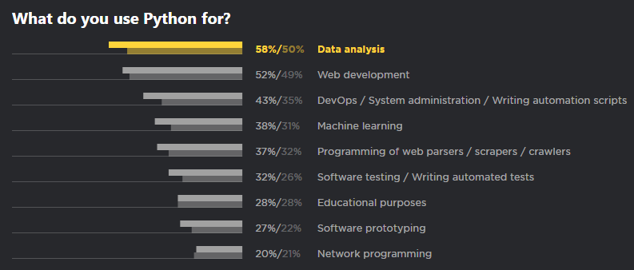
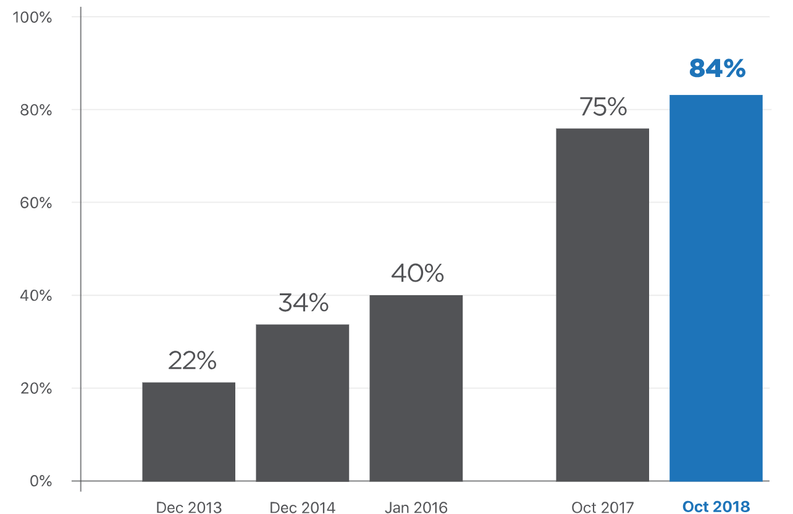

> 今晚给计算机兴趣小组的同学讲解了 Python 的基本语法，感觉效果一般。一方面来看，我的一些表达还有问题，另一方面也受到了时间的限制。
>
> 没有写 PPT，而是写了一个简短的提纲，并且结合代码来进行演示，本以为他们学习了VB，对变量、函数等概念也许很容易理解，但似乎并不是如此。
>
> 如何去教会一个小白编程，是一个值得思考的问题。

# Python

1989年圣诞节期间，在阿姆斯特丹，Guido为了打发圣诞节的无趣，决心开发一个新的脚本解释程序

Python之父

Guido van Rossum (BDFL)

## 应用

使用 Python 最多的领域是数据分析，超过58%，其次才是Web开发、运维、机器学习、网络爬虫、测试等。

## Python2 or Python3

到今年截止，使用Python3的比例达到84％，这个数据在2017年还是75%，可以预见未来两年，Python3将覆盖90%以上，因为到2020年，Python2就将正式停止维护了。

## 语法快速入门

解释型、跨平台、面向对象

### 变量名：

可以包括英文、数字以及下划线，但不能以数字开头，区分大小写

### 变量类型：

弱类型语言、无需声明

- 数字 Number：整型和浮点型
- 字符串 String：字符串拼接、长度、切片
- 列表 List：添加元素、求长、切片、删除
- 元组 Tuple：readonly
- 字典 Dictionary

### 注释：，三引号

### 保留字符：

and，not，class，def，等等等等
行和缩进

### 运算符：

- 算术运算符：+，-，* ，/，%
- 比较运算符：==，!=，>，<，>=，<=
- 赋值运算符：=，+=，-=，*=，/=，%=
- 逻辑运算符：and，or，not

### 条件：

- if...
- if…else...
- if…elif…else

### 循环：

- while
- for，for 遍历 list 和 dict

### 循环控制：

- break
- continue
- pass