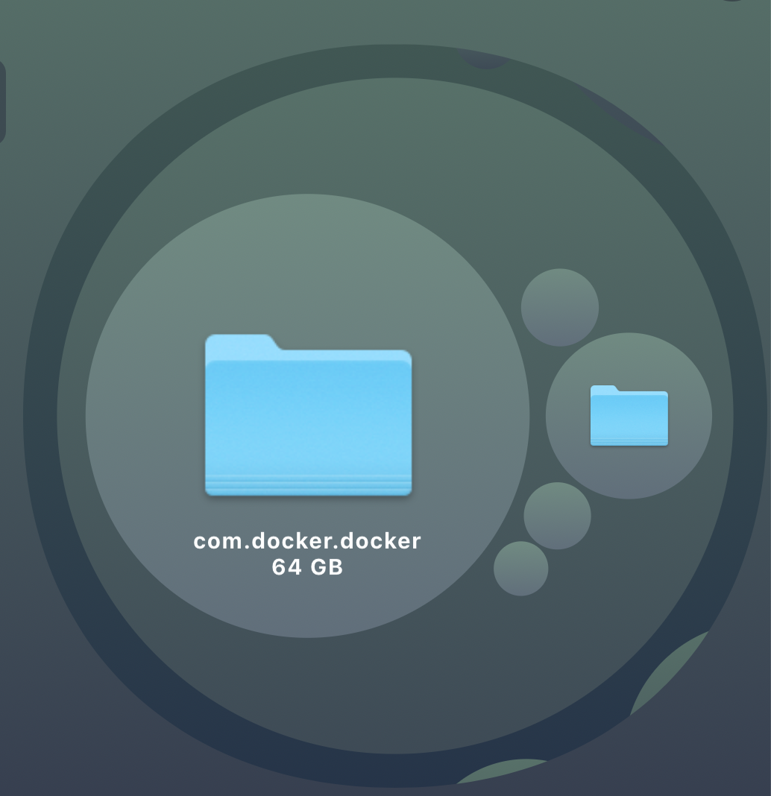
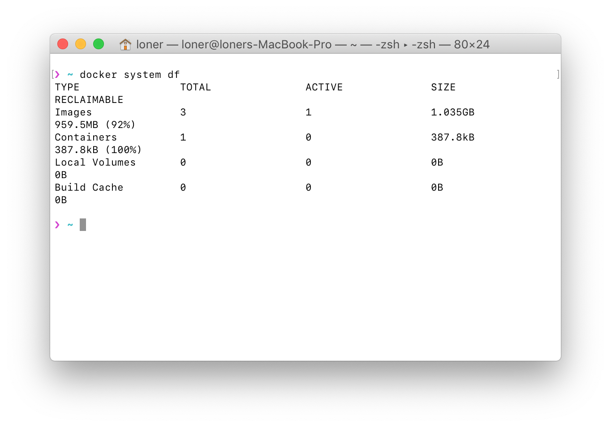

之前在 mac 上安装了 Docker，去尝试部署了一下 Flask 应用，弄完了以后也就没关，结果昨天 CleanMyMac 突然提醒我清理磁盘空间，一看 500g 的硬盘还剩下了100g 可用，想了想，最近也没下载什么东西啊，扫描了一下大文件，也只是发现几部电影而已。隧用空间透镜查看，发现 Docker 竟然占用了 64GB 的空间，吓人一跳。

于是迅速 Google，找到使用 ``docker system df``可以看到 Docker 对磁盘的占用情况：

然而这只是 Docker 占用的情况，而不包含 Docker 本身的占用，查出来的情况确实也和 64gb 相差甚远。

再查！

找到了这篇文章：

https://xts.so/docker/Cleaning-up-Docker-For-Mac.html

好吧，没用，还是 64gb。。。。。