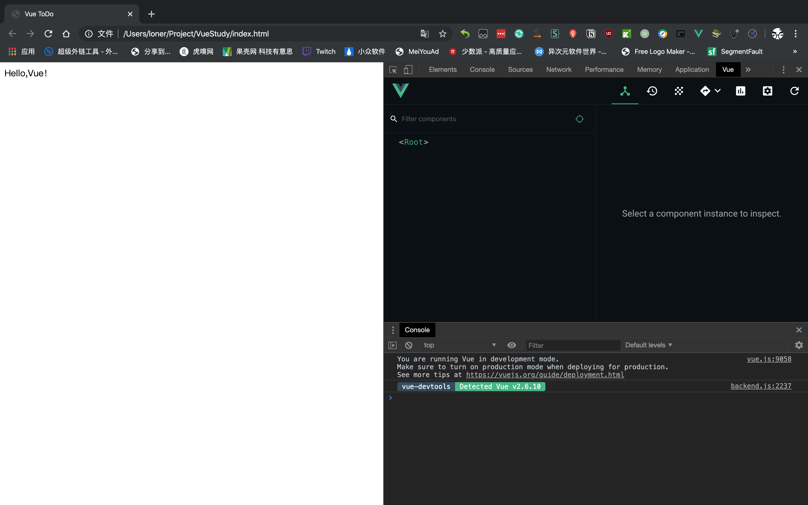
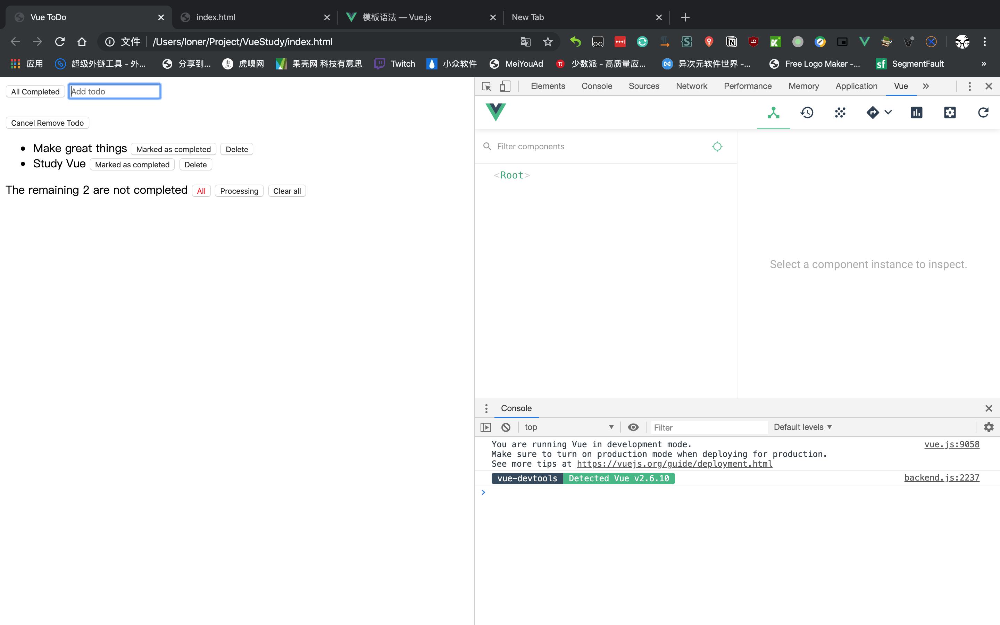

花了点时间学习 Vue ，撸了一个 Todo 应用，对 Vue 有了一个基本的概念，总的来说还是比较友好的，我并不熟悉 JavaScript 的使用，尤其是 ES6 的那些新特性都没有很清晰的概念，但边看边查，也没有感到很大障碍，也借此多了解了一些关于 ES6 的语法。





代码如下：

```javascript
<!DOCTYPE html>
<html lang="en">
<head>
    <meta charset="UTF-8">
    <script src="https://cdn.jsdelivr.net/npm/vue/dist/vue.js"></script>
    <title>Vue ToDo</title>
    <style>
    .completed {
      text-decoration: line-through;
    }
    .selected {
      color: red;
    }
    .empty{
        border-color: red;
    }
    </style>
</head>
<body>
    <div id="todo-app">
        <div>
            <input type="button" @click="makeAllCompleted()" value="All Completed">
            <input type="text" 
                    v-model="newTodoTitle" 
                    @keyup.enter="addTodo"
                    v-bind:class="{empty:emptyChecked}"
                    placeholder="Add todo">
            <span v-if="emptyChecked" style="color: red;">Plaease input something</span>
        </div>
        <!--todo list-->
        <div v-if="hasRemovedTodo">
            <br>
            <input type="button" @click="restoreTodo()" value="Cancel Remove Todo">
        </div>
        <ul>
            <li v-for='todo in filterTodos':key='todo.id'>
                <span :class="{completed:todo.completed}" @dbLclick="editTodo(todo)" >{{ todo.title }}</span>
                <input type="button" v-if="!todo.completed" @click="markAsCompleted(todo)" value="Marked as completed">
                <input type="button" v-if="todo.completed" @click="markAsUncompleted(todo)" value="Marked as uncompleted">
                <input type="button" @click="removeTodo" value="Delete">
                <input type="text" 
                        v-if="editedTodo !== null && editedTodo.id===todo.id" 
                        v-model="todo.title" @keyup.enter="editDone(todo)" 
                        @keyup.esc="cancelEdit(todo)" 
                        v-focus='true'
                        value="Edit todo list...">
            </li>
        </ul>
        <span v-if="lastTodosCount">The remaining {{ lastTodosCount }} are not completed</span>
        <span v-else-if="completedCount">You finished all todo</span>
        <span>
            <input type="button" value="All" @click="intention='all'" v-if="allTodoCount" v-bind:class="{selected:intention==='all'}">
            <input type="button" value="Processing" @click="intention='processing'" v-if="lastTodosCount" v-bind:class="{selected:intention==='processing'}">
            <input type="button" value="Completed" @click="intention='completed'" v-if="completedCount" v-bind:class="{selected:intention==='completed'}">
            <input type="button" value="Clear the completed todo" @click="clearAllCompleted" v-if="completedCount">
            <input type="button" value="Clear all" @click="clearAll" v-if="allTodoCount">
        </span>
    </div>
</body>
<script>
    let id = 0; // id
    var app = new Vue({
        el:'#todo-app',
        data:function(){
            return {
                todos:[],
                newTodoTitle:'',
                removedTodo: null,
                editedTodo:null,
                checkEmpty: false,
                intention:'all'
            }
        },
        methods: {
            addTodo:function() {
                if (this.newTodoTitle == '') {
                    this.checkEmpty = true;
                    return 
                }
                this.todos.push({id: id++, title: this.newTodoTitle, completed:false});
                this.newTodoTitle = '';
                this.checkEmpty = false
            },
            removeTodo:function(todo){
                let pos = this.todos.indexOf(todo);
                this.removedTodo = {
                    pos: pos,
                    todo: this.todos.splice(pos, 1)[0]
                    }
            },
            restoreTodo: function () {
                let pos = this.removedTodo.pos;
                let restored = this.removedTodo.todo;
                this.todos.splice(pos, 0, restored);
                this.removedTodo = null;
            },
            markAsCompleted:function(todo){
                todo.completed = true;
            },
            markAsUncompleted:function(todo){
                todo.completed = false;
            },
            editTodo:function(todo){
                this.editedTodo = {id:todo.id, title: todo.title, completed:todo.completed};
            },
            editDone:function(todo){
                if(todo.title === ''){
                    this.removeTodo(todo);
                }
                this.editedTodo = null;
            },
            cancelEdit:function(todo){
                todo.title = this.editedTodo.title;
                this.editedTodo = null;
            },
            makeAllCompleted:function(){
                this.todos.map(
                    /*
                    function(todo){
                        if(!todo.completed){
                            todo.completed = true
                        }
                    }*/
                    todo => todo.completed = true // Arrow Function
                )
            },
            clearAll:function(){
                this.todos = []
            },
            clearAllCompleted:function(){
                this.todos = this.lastTodos
            }
        },
        computed:{
            emptyChecked:function(){
                return this.newTodoTitle.length === 0 && this.checkEmpty
            },
            hasRemovedTodo:function(){
                return !!this.removedTodo
            },
            lastTodosCount: function () {
                let count = this.todos.filter(todo => !todo.completed).length
                return count
            },
            lastTodos:function(){
                return this.todos.filter(todo => !todo.completed)
            },
            filterTodos:function(){
                if(this.intention==='processing'){
                    return this.lastTodos
                }
                else if(this.intention==='completed'){
                    return this.todos.filter(todo => todo.completed)
                }
                else{
                    return this.todos
                }
            },
            completedCount:function(){
                return this.todos.filter(todo => todo.completed).length
            },
            allTodoCount:function(){
                return this.todos.length
            },
        },
        directives:{
            focus:{
                inserted:function(el){
                    el.focus()
                }
            }
        }
    })
</script>
</html>
```

