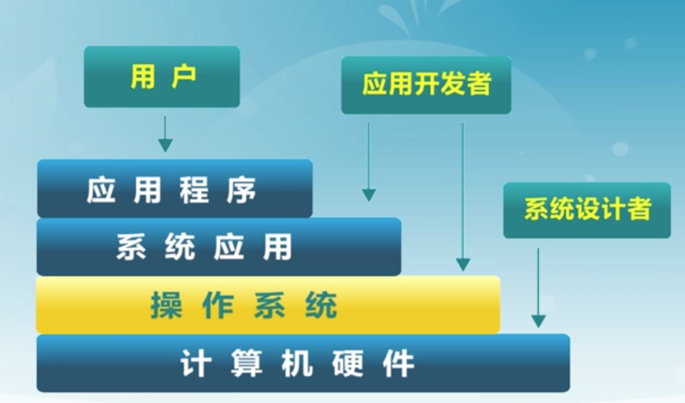
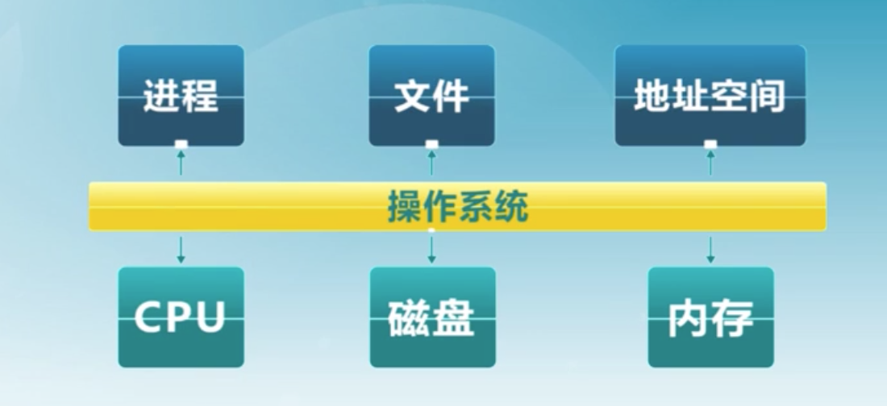
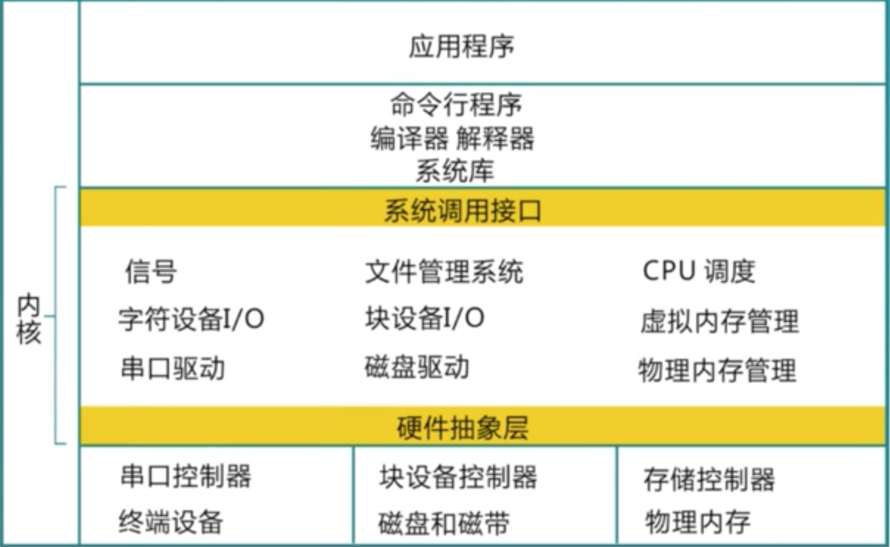

> 本文是我学习在学堂在线上由清华大学开设的操作系统课程的相关笔记，你可以通过下面的链接找到课程相关内容：
>
> 学堂在线：http://www.xuetangx.com/courses/course-v1:TsinghuaX+30240243X+sp/about
>
> 课程维基：http://os.cs.tsinghua.edu.cn/oscourse/OS2019spring
>
> 课程实验、练习：https://github.com/chyyuu/os_course_info
>
> "实验楼"在线实验环境：http://www.shiyanlou.com/courses/221

# 什么是操作系统

* 没有公认的精确定义
* 操作系统是一个控制程序
* 操作系统是一个资源管理器

## 操作系统的地位

## 操作系统软件分类

* 软件
  * 应用软件
  * 系统软件
    * 系统应用
    * 操作系统
      * 命令行
      * 内核

## 操作系统软件的组成

* Shell —— 命令行接口
* GUI —— 图形用户接口
* Kernel —— 操作系统内部

## ucore 教学操作系统

## 操作系统内核特征

* 并发
  * 同时运行多个程序，需要 OS 管理
* 共享
  * “同时”访问
  * 互斥共享
* 虚拟
  * 让每个用户都觉得有一个专门的计算机在为他服务
* 异步

## 操作系统实例

* UNIX 家族

* Linux 家族
* Windows 家族

## 操作系统的演变

**底层技术变化推动操作系统改变**

* 单用户系统（1945——1955）
  * 操作系统=装载器+通用子程序库
  * 昂贵逐渐的低利用率
* 批处理系统 （1955——1965）
* 多程序系统（1965——1980）
  * 保持多个工作在内存中并且在各工作间复用 CPU
* 分时（1970——）
  * 定时终端用于工作对 CPU 的复用
* 个人计算机：每个用户一个系统
* 分布式计算：每个用户多个系统

## 操作系统结构

* 简单结构
  * MS-DOS ——在最小的空间，设计用于提供大部分功能（1981——1994）

* 分层结构

* 微内核结构（Microkernel）
  * 尽可能把内核功能移到用户空间
  * 用户模块间使用消息传递
  * 好处：灵活/安全
  * 缺点：性能
* 外核结构（Exokernel）
* VMM（虚拟机管理器）
  * 虚拟机管理器将单独的机器接口转换成许多的虚拟机，每个迅疾都是一个元素计算机的有效副本，并能完成所有的处理器指令