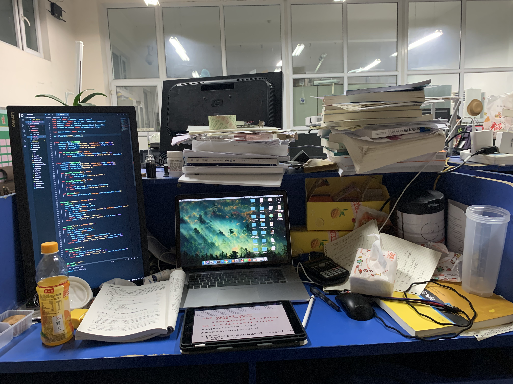

2017年第一次写总结（总共四行字，在微博上还可以找到），2018年好像没写（写了我也想不起来了，找了一下，没有），转眼2019过去了，上半年就写了一次，时过境迁，形势又大有不同了。

这一年，五味杂陈，也有着数个这样的深夜，对着电脑敲下文字，这一年还真是写了很多东西。对于自身的思考，也多了起来。好像有点混乱，实在是，这一年着实的，着实的太多东西了，深刻且繁杂。

这一年，最为深刻的事情就是认识了她，是的，我也只能谈谈深刻了。1942年，毛泽东在延安文艺座谈会上的讲话中指出：“为什么人的问题，是一个根本的问题，原则的问题。”还说：“这个根本问题不解决，其他许多问题也就不易解决。”伟大导师诚不欺我，终究是落得一片白茫茫大地真干净。关于她，想了太多，反而觉得没什么可写的了。
**似此星辰非昨夜，为谁风露立中宵。**

历史发展有着必然性，在人身上，或许没有历史如此的宏大，但事情往往也有着必然性。这就出现了一个需求，那就是为了更好的去应对发展趋势，我迫切需要去掌握那样的规律，并使之成为行动指南，如此，心想事成不过是轻而易举。这也许是2019年我所想到的，最为深刻和重要的一点。

关于2020，最重要的事情就是备战考研，具体的规划等寒假回家再写，总之是要破釜沉舟。
2019，我和我的两位亲密战友相互帮助了许多，我们伟大的友谊又得到了巨大的升华，虽然三个人在地图上连三条线能把半个中国圈起来，不过这没能影响我们伟大的革命友谊，我们已然决定，为了我们伟大的友谊，考上研究生，北京会师。

2019年很丰富，痛苦与快乐都有许多，都是原来不曾经历的，我亦思考了许多，学到了很多。与之前的十九年相比，2019是变革的一年，而在未来，我想亦会是有着更加翻天覆地的变化。
我们必须准备进行同过去时代的斗争形式有着许多不同特点的伟大斗争，让我们满怀信心，迎来21世纪第三个十年的伟大斗争！

2019过去了，我会记住这一年的。

*多少事，从来急*
*天地转，光阴迫*
*一万年太久，只争朝夕*

**前进，达瓦里希！**

2020年1月1日凌晨