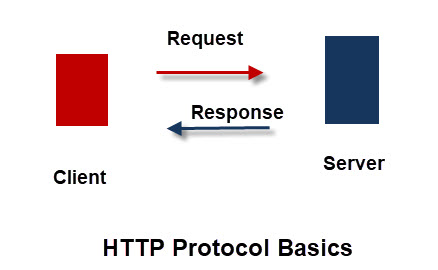
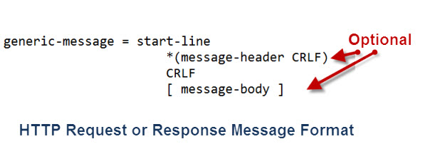
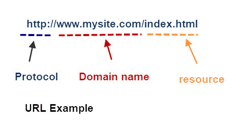
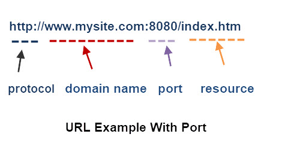
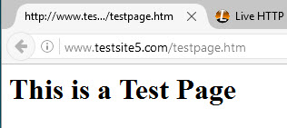
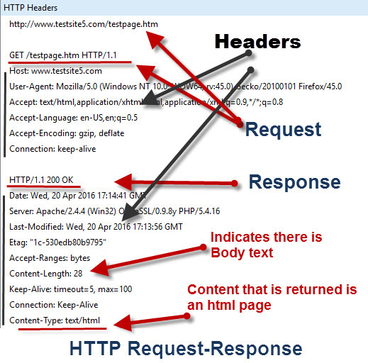

>本文翻译自 Steve Cope 的《Understanding HTTP Basics》，翻译及发布已获作者授权。
>
>翻译为本人原创，未经授权，禁止转载。
>
>原文地址：http://www.steves-internet-guide.com/http-basics/

HTTP 即超文本传输协议，用于 Web 数据传输。

它是 Web 开发人员必须了解的关键协议，它有着十分广泛的应用，例如在 IOT（物联网） 应用中传输数据和命令。

HTTP 协议的第一个版本只有一种方法，也就是 GET，使用这个方法将从服务器请求（request）一个页面。

对应的服务器的响应（response）始终是 HTML 页面。-[Wiki](https://zh.wikipedia.org/wiki/超文本传输协议)

为了让你了解 HTTP 协议的启动过程有多简单，请看一下只有一页的原始规范：[Original specification](https://www.w3.org/Protocols/HTTP/AsImplemented.html)

从最初的 0.9 版本开始，已经有了很多个 HTTP 协议版本。

目前的版本是1.1，最近一次的修订在2014年，更多的信息可以查看[Wiki](https://zh.wikipedia.org/wiki/超文本传输协议)

# 如何运行

像大多数 Internet 协议一样，HTTP 是使用客户端-服务器模式（即 C/S 模式）的基于方法和响应信息的协议。

客户端发出请求，服务器作出响应。

HTTP 协议也是一种无状态协议，这意味着服务器不需要存储会话信息，每个请求都彼此独立。参见-[无状态协议](https://zh.wikipedia.org/wiki/无状态协议)

这表示：

* 所有的请求都来自客户端（浏览器）
* 服务器响应请求
* 以可读文本的形式来请求和响应
* 请求之间彼此独立，服务器无需跟踪请求

# 请求和响应的结构

请求和响应是相同的，如下图所示：

一个请求由这些组成：

请求或方法 + 标题（可选）+ 正文（可选）

一个响应由这些组成：

状态码 + 标题（可选）+ 正文（可选）

简单的 CRLF（回车和换行）组合被用来区分各个部分，单个空白行用于指示标题的结尾。

如果请求或响应中包含正文，则应该在标题中指出。

>消息中允许消息正文的规则因请求和响应而不同。头字段中的Content-Length或Transfer-Encoding是请求中消息体存在的信号。请求消息的构成与方法语义是独立的，即使方法没有定义任何消息体的使用。*– RFC 7230 section 3.3.*

注意：消息正文后没有 CRLF

# HTTP 请求

我们之前介绍了一般的请求响应格式，现在我们将更加详细到的介绍请求消息。

起始行是强制性的，它的结构如下：

方法 + 资源路径 + 协议版本

例如我们尝试访问 www.testsite5.com 上的 testpage.htm，起始行应该是这样的：

**GET /testpage.htm HTTP/1.1**

* GET 是方法
* /tesspage.htm 是资源的相对路径
* HTTP/1.1 是使用的协议版本

注意：

1. 相对路径不包含域名
2. 浏览器使用我们输入的 URL 来创建资源的 URL

**URL** 即统一资源定位符。

浏览器不会显示实际的 http 请求，只有用特殊工具才能看到请求。

# HTTP vs URL

大多数人都熟悉在浏览器中输入 URL，就像这样：

URL 通常包含被浏览器隐藏的端口号，但是你可以手动添加它：

输入 URL 将告诉浏览器要定位的资源的地址以及用于检索资源的协议。

http 是将资源（网页、图片、视频等）从服务器传输到客户端的协议。

# HTTP 响应和响应码

每一个请求都有一个响应。响应由这些组成：

* 状态码和描述
* 一个或者更多的标题（header）（可选）
* 可以是很多行、可包含二进制信息的正文（可选）

响应状态码分为5类，每一类都有含义和三位数的代码：

* 1xx – 信息
* 2xx – 成功
* 3xx – 重定向
* 4xx – 客户端错误
* 5xx – 服务端错误

例如，成功的页面请求会返回 200，而不成功的则返回 400。

你可以在这里找到完整的状态码列表和含义：[here](https://developer.mozilla.org/zh-CN/docs/Web/HTTP/Status)

# 请求-响应 例子

我们访问一个简单的网页并检查它的请求和响应。

这是在地址栏输入的内容：

这是浏览器显示的响应：

这是后台发生的 http 请求响应：

注意，请求头是由浏览器自动插入的，响应头是有服务器插入的。

请求中没有正文内容，响应中的正文内容是网页，并显示在浏览器中。

# 请求类型

到现在为止，我们还没有提到请求类型，但是在示例中我们已经看到了 GET 类型。

GET 类型用于从 web 服务器请求资源。

GET 是最常用的请求类型，并且是原始 HTTP 规范中唯一的请求类型。

# 请求类型、方法和动词

HTTP 协议支持8种请求类型，在文档中也被称为方法或动词。

* GET – 从服务器请求资源
* POST – 向服务器提交资源
* PUT – 替换资源
* DELETE – 删除资源
* HEAD – 类似于 GET ，但只返回头（header），不返回正文（content）
* OPTIONS – 用于客户端查看服务器的性能。 这个方法会请求服务器返回该资源所支持的所有HTTP请求方法
* PATCH – 类似于 PUT，但一般用于对资源的局部更新
* TRACE – 回显服务器收到的请求

如今，在网络上，POST（提交表单） 和 GET（获取网页） 是最常用的方法

在使用 Web 和 IOT APIs 时，将使用其他的方法。

关于它们，在 [w3 school](https://www.w3school.com.cn/tags/html_ref_httpmethods.asp) 上很好的概述，在 Microsoft [MDN](https://developer.mozilla.org/zh-CN/docs/Web/HTTP/Methods) 网站上有更详细的介绍。

