>这是学习吴恩达《机器学习》的相关笔记
>
>相关内容：[深度学习计划](https://loner1024.top/深度学习计划.html)

Notation:
**m** = Number of training examples

**x**’s = “input” variable / features

**y**’s = “output” variable / “target” variable

In this data set , m = 47

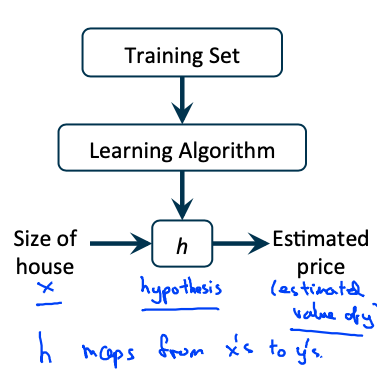

**h：**hypothesis，假设函数，代价函数

**How do we represent h **

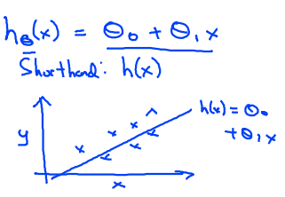

**Linear regression with one variable. Univariate （单变量） linear regression.**（一元线性回归）

# Cost function

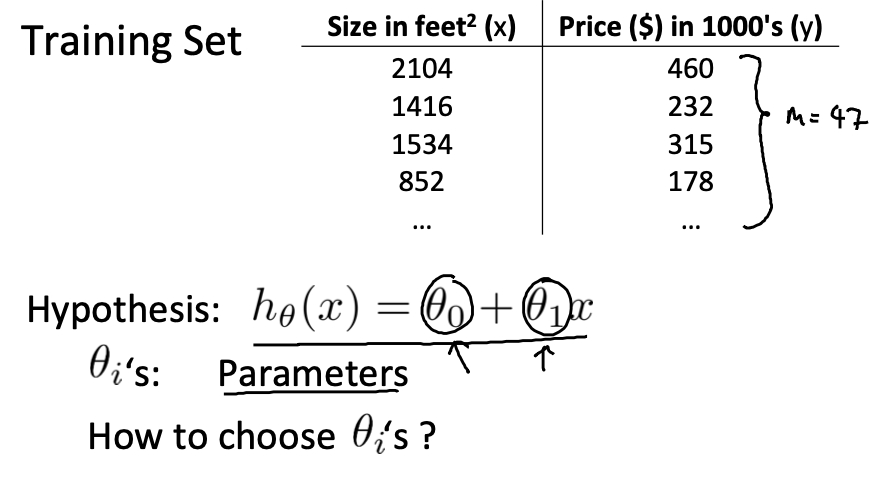

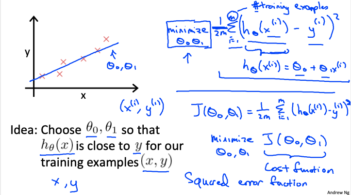

$minimize \frac{1}{2m}\sum^{m}_{i=1}(h_Θ(x^i)-y^i)^2$

*among them:* 

$h_Θ(x^i)=Θ_0+Θ_{x^{(i)}}$

*and then:*

$J(Θ_0,Θ_1)=\frac{1}{2m}\sum^{m}_{i=1}(h_Θ(x^i)-y^i)^2$

*whitch is:*

$minimize J(Θ_0,Θ_1)$

This function is **cost function**（代价函数）. Also called **squared error function**（平方误差函数）.

# Cost function intution

Using this sipmlified definition of hypothesizing cost function, let's try to understand the cost function concept better.

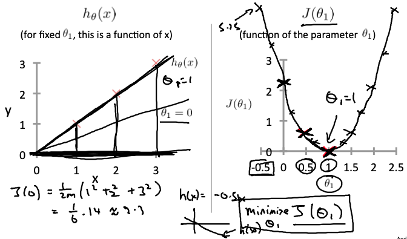

For each value of Θ , we wound up with a different value of function J, we could use his to trace out this plot on the right. 

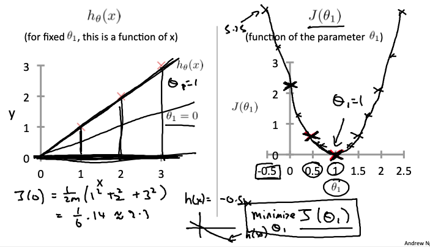

The optimization objective for our learning algorithm is we want choose the value of Θ that minimizes  J .

Back the origin function

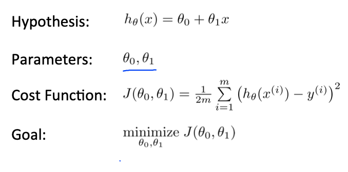

When use two parameters, the plot maybe:

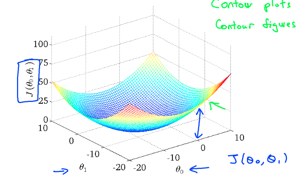

**bowl function**

# Gradient descent

（梯度下降）

Have some function $J(Θ_0,Θ_1)$

Want $min J(Θ_0,Θ_1)$

**Outline**：

* Start with some $Θ_0,Θ_1$
* Keep changing  $Θ_0,Θ_1$ to reduce $J(Θ_0,Θ_1)$ until we hopegully end up at a minimum

## Gradient descent algorithm

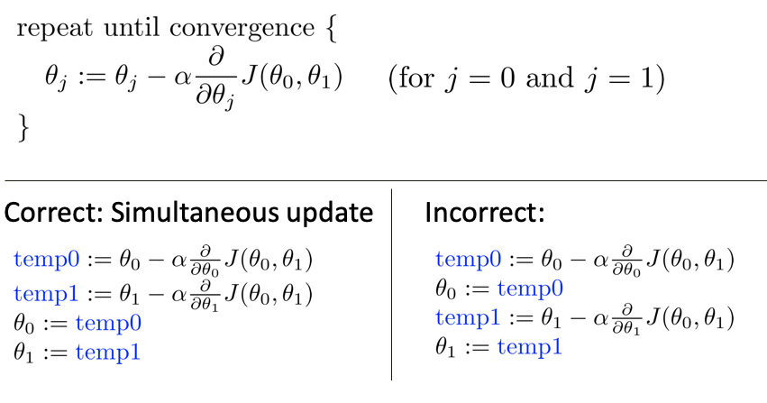

**:=** Denote assignment

**α** learning rate（学习率）, it basically controls how big a step we take downhill with gradient descent.

# Gradient descent intuition

**About derivative**

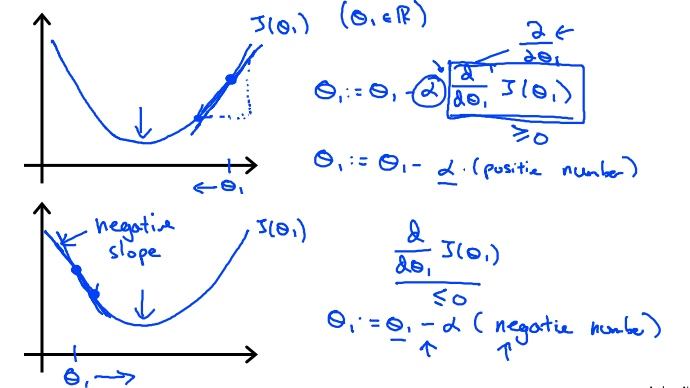

通过导数项（斜率）使Θ的值向中间靠拢，通过α控制下降速度。

**About α**

If α is too small, gradient descent can be slow.

If α is too large, gradient descent can overshoot the minimum. It may fail to converge, or even diverge.

If $Θ_1$ at a local optimum or the local minimum, the derivative would be equal to 0, in gradient descent update, $Θ_1$ unchanged.

Gradient descent can converge to a local minimum, even with the learning rate α fixed.

As we approach a local minimum, gradient descent will automatically take smaller steps. So, no need to decrease α over time. 

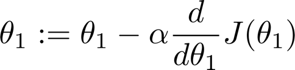

妙啊！通过导数来控制步长，逐渐收敛。

# Gradient descent for linear regression

**Gradient descent algorithm**

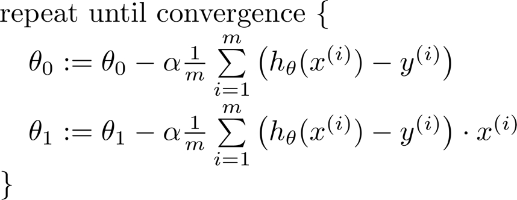

cost function for liner regression is always going to be a convex function（凸函数）.

**“Batch” Gradient Descent**

（批量梯度下降）

“Batch”: Each step of gradient descent uses all the training examples.

指的是在梯度下降的每一步中，我们都用到了 所有的训练样本。

# 线性代数

学过，复习了一遍，没有笔记

