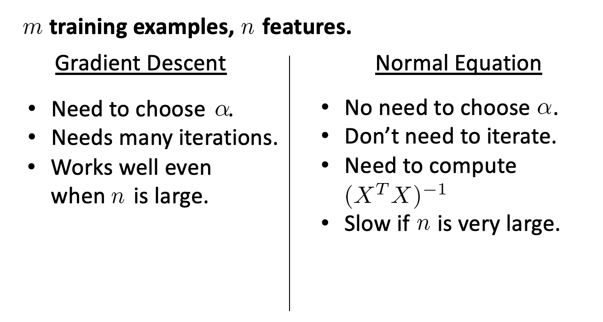

>这是学习吴恩达《机器学习》的相关笔记
>
>相关内容：[深度学习计划](https://loner1024.top/深度学习计划.html)

# LinearRegressionwithMultipleVariables （多元线性回归）

## 多维特征（Multiple Features）


引入多个变量到线性回归模型中。

$n=$ 变量数量

$x^i=$  第 i 个变量的训练数据集

$x_j^i=$  第 i 个变量的训练数据的第 j 个数据

对于多变量，新的 $h$ 假设为：$h_𝜃(𝑥) = 𝜃_0 + 𝜃_1𝑥_1 + 𝜃_2𝑥_2+. . . +𝜃_n𝑥_n$ 

为了使公式简化，引入 $x_0=1$，则公式变为：$h_𝜃(𝑥) = 𝜃_0x_0 + 𝜃_1𝑥_1 + 𝜃_2𝑥_2+. . . +𝜃_n𝑥_n$ 

此时参数和变量都为$n+1$个

$x=\left[
 \begin{matrix}
   x_0  \\
   x_1  \\
   x_2  \\
   …  \\
   x_n
  \end{matrix}
  \right]                    𝜃=\left[
 \begin{matrix}
   𝜃_0  \\
   𝜃_1  \\
   𝜃_2  \\
   …  \\
   𝜃_n
  \end{matrix}
  \right] $

公式可简化为：$h_𝜃(x)=𝜃^Tx$

矩阵转置后相乘

## 多变量梯度下降（Gradient Descent for Multiple Variables）

多变量线性回归的批量梯度下降算法为：


求导后得到：

$$\begin{align*}& \text{repeat until convergence:} \; \lbrace \newline \; & \theta_j := \theta_j - \alpha \frac{1}{m} \sum\limits_{i=1}^{m} (h_\theta(x^{(i)}) - y^{(i)}) \cdot x_j^{(i)} \; & \text{for j := 0...n}\newline \rbrace\end{align*}$$

## 特征缩放（Feature Scaling）

如果一个问题有多个特征（Feature），并且特征的不同取值都在一个相近的范围内，这样梯度下降法就能更快的收敛。

假设我们使用两个特征，房屋的尺寸和房间的数量，尺寸的值为 0- 2000 平方英尺，而房间数量的值则是 0-5，以两个参数分别为横纵坐标，绘制代价函数的等 高线图能，看出图像会显得很扁，梯度下降算法需要非常多次的迭代才能收敛。


解决的方法是尝试将所有特征的尺度都尽量缩放到-1 到 1 之间 

### 均值归一化

令$$x_i=\frac{x_i-μ_i}{S_i}$$，$μ_i$是平均值，$S_i$是数据范围。

## 学习率（Learning Rate）

### Deebug

如何确保梯度下降正常运行？

我们可以绘制迭代次数和代价函数的图表来观测算法在何时趋于收敛。


另外，也可以进行一些自动的收敛测试，让一种算法来告诉我们梯度下降算法是否已经收敛。例如为$J(\theta)$ 设置一个阈值，但通常要寻找一个合适的阈值并不容易。因此通过 $J(\theta)-迭代次数$ 曲线图来观察是一种更好的方式。

### $\alpha$

梯度下降算法的每次迭代受到学习率的影响，如果学习率𝑎过小，则达到收敛所需的迭代次数会非常高;如果学习率𝑎过大，每次迭代可能不会减小代价函数，可能会越过局部最小值导致无法收敛。

可以尝试多个$\alpha$值，绘制出$J(\theta)$随迭代次数变化的图像，再观察图像，选择最合适的$\alpha$值。

𝛼 = 0.01，0.03，0.1，0.3，1，3，10

## 特征和多项式回归（Features and Polynomial Regression）

 我们可以自由选择使用什么特征，并通过设计不同的特征，我们可以用更复杂的函数来拟合数据。一些算法能帮助我们自动选择要使用什么特征。

## 正规方程

正规方程提供了一种求$\theta$的解析解法，可以不使用迭代算法，直接求解$\theta$的最优值。

如：


可以通过求解$\frac{\alpha}{\alpha\theta_j}J(\theta)=0$ 找出 $\theta$ .

假设我们的训练集特征矩阵为 𝑋(包含了 𝑥0 = 1)并且我们的训练集结果为向量 𝑦，则利用正规方程解出向量 $\theta = (𝑋_𝑇𝑋)^{-1}𝑋^𝑇_y$。

$(𝑋_𝑇𝑋)^{-1}$是$(𝑋_𝑇𝑋)$的逆矩阵

Octave 中的正规方程：

```octave
pinv(x'*x)*x'*y
```

### 优缺点



| 梯度下降                    | 正规方程                                |
| --------------------------- | --------------------------------------- |
| 需要选择 $\alpha$           | 不需要 $\alpha$                         |
| 需要多次迭代                | 一次运算                                |
| 即使 $n$ 很大时也能良好运行 | 需要计算 $(𝑋_𝑇𝑋)^{-1}$ 复杂度大$O(n^3)$ |
| 适用于各类模型              | 只适用于线性回归                        |

## 正规方程及不可逆性 （Normal Equation Noninvertibility

**$$\theta = (𝑋_𝑇𝑋)^{-1}𝑋^𝑇_y$$**

$(𝑋_𝑇𝑋)$ 不可逆的情况很少发生，在Octave中计算时，你会得到一个正常的解，因为在Octave中有两个函数可以求解矩阵的逆——`pinv`和`inv`。

> 首先，看特征值里是否有一些多余的特征，像这些${x_{1}}$和${x_{2}}$是线性相关的，互为线性函数。同时，当有一些多余的特征时，可以删除这两个重复特征里的其中一个，无须两个特征同时保留，将解决不可逆性的问题。因此，首先应该通过观察所有特征检查是否有多余的特征，如果有多余的就删除掉，直到他们不再是多余的为止，如果特征数量实在太多，我会删除些用较少的特征来反映尽可能多内容，否则我会考虑使用正规化方法。
> 如果矩阵$X'X$是不可逆的，（通常来说，不会出现这种情况），如果在**Octave**里，可以用伪逆函数`pinv()` 来实现。这种使用不同的线性代数库的方法被称为伪逆。即使$X'X$的结果是不可逆的，但算法执行的流程是正确的。总之，出现不可逆矩阵的情况极少发生，所以在大多数实现线性回归中，这不是一个大问题。

## Octave 教程（Octave Tutorial）

[https://loner1024.top/Octave%E6%95%99%E7%A8%8B.html](https://loner1024.top/Octave教程.html)