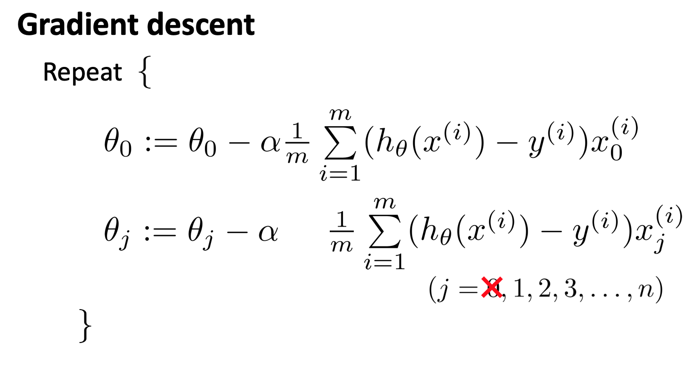

> 这是学习吴恩达《机器学习》的相关笔记
> 
> 相关内容：[深度学习计划][1]

# 逻辑回归

## 分类

**二分类**

$y\in\{0,1\}$

0: “Negative Class“ 负类

1: ”Positive Class” 正类

线性回归的方法应用于分类问题并不是一个好主意，所以我们会开发一个名为**逻辑回归（logistic regression）**的算法，它的特点是，算法的输出或者说预测值一直介于0和1之间。

## 假说陈述

我们希望我们的假设函数$h(\theta)$在$[0,1]$这个区间范围内：

$h\_\theta(x)=g(\theta^Tx)$

$g(z)=\frac{1}{1+e^{-z}}$

假设函数：

$h\_\theta(x)=\frac{1}{1+e^{-\theta^Tx}}$

![截屏2020-02-06下午1.34.49][image-1]

这个函数就叫Sigmoid function（S型函数） 或者 Logistic function（逻辑函数）

$\begin{align*}& h\_\theta (x) = g ( \theta^T x ) \newline \newline& z = \theta^T x \newline& g(z) = \dfrac{1}{1 + e^{-z}}\end{align*}$

## 决策边界

$h\_\theta(x)=g(\theta^Tx)=P(y=1|x;\theta)$

这个假设函数输出的是给定参数 $x$ 和 $\theta$ 时，$y=1$ 的估计概率。

所以我们想要预测 $y=1$ 还是 0，我们可以这样做：

“$y=1$”  if $h\_\theta(x) \>= 0.5$ 

"$y=0$" if $h\_\theta(x) \< 0.5$ 

![截屏2020-02-06下午1.34.49][image-2]

观察图像我们可以发现，

当 $z\>0$ 时，$g(z)$ 即$h\_\theta(x) \> 0.5$ 

当 $z<0$ 时，$g(z)$ 即$h\_\theta(x) < 0.5$ 

$h\_\theta(x)=\frac{1}{1+e^{-\theta^Tx}}$

所以，当 $\theta^Tx >=0$ 时，$h_\theta(x) \>= 0.5$,

当 $\theta^Tx <0$ 时，$h_\theta(x) < 0.5$

![截屏2020-02-06下午3.37.44][image-3]

假设我们现在已经拟合好三个参数了： $\theta\_0=3,\theta\_1=1,\theta\_2=1$

当 $-3+x\_1+x\_2\>=0$ 时，y=1

我们可以在图上画出 $x\_1+x\_2=3$ 这条线，这条线就是我们的决策边界。

决策边界是假设函数的属性，决定与其参数，与数据集无关。

**训练集拟合参数，参数决定边界**

## 代价函数

![截屏2020-02-06下午4.09.34][image-4]

如何选择参数 $\theta$ ?

如果我们对于 $h\_\theta(x)=\frac{1}{1+e^{-\theta^Tx}}$ 使用线性回归的代价函数，会发现得到的代价函数是一个**非凸函数**，这意味着会有很多局部最小值。因此，我们要另外找一个不同代价函数使我们能够很好的使用算法，而且能够保证找到全局的最小值。

### 逻辑回归的代价函数

$$Cost(h_\theta(x),y)=\begin{cases} -log(h_\theta(x)), & \text {if $y=1$} \\ -log(1-h\_\theta(x)), & \text{if $y$=0} \end{cases}$$

图像：

![截屏2020-02-06下午4.31.41][image-5]


![image-20200206163347433][image-6]

## 简化代价函数和梯度下降

$$Cost(h_\theta(x),y)=\begin{cases} -log(h_\theta(x)), & \text {if $y=1$} \\ -log(1-h\_\theta(x)), & \text{if $y$=0} \end{cases}$$

因为 y 总是等于 0 或 1，所以我们可以把代价函数简化为一个式子： 

$\mathrm{Cost}(h_\theta(x),y) = - y \; \log(h_\theta(x)) - (1 - y) \log(1 - h\_\theta(x))$

我们可以得到 Logistic 回归的代价函数：


这个式子是从统计学中的极大似然法中来的，它是统计学中为不同的模型快速寻找参数的方法。

为了拟合参数，我要找出尽可能使 $J(\theta)$ 小的 $\theta$ 值。

$\underset{\theta}min J(\theta)$

![截屏2020-02-06下午10.31.50][image-7]

Logictis 梯度下降的模版和线性回归的梯度下降是相同的，但由于假设定义的不同，因此这两个梯度下降其实是不同的东西，在线性回归中 $h_\theta(x)=\theta^Tx$, 在 Logictis 回归中 $h_\theta(x)=\frac{1}{1+e^{-\theta^Tx}}$

## 高级优化

我们可以使用一些高级优化算法来加快梯度下降的速度，例如：

* Conjugate gradient（共轭梯度法）

* BFGS

* L - BFGS

这三种算法的优点不需要手动选择学习率 $\alpha$ ，而且收敛速度远远快于梯度下降算法，缺点是这些算法十分复杂。

![截屏2020-02-06下午11.47.24][image-8]

使用这些算法，我们首先要实现这样一个函数。 

```octave
function [jVal, gradient]=costFunction(theta)
　　jVal=(theta(1)-5)^2+(theta(2)-5)^2; 
　　gradient=zeros(2,1);    
　　gradient(1)=2*(theta(1)-5);    
　　gradient(2)=2*(theta(2)-5); 
end
```

函数返回两个值，`jVal`是我们的计算的代价函数 J，`gradient`是一个2\*1的向量，对应公式中的两个偏导数项。

运行这个函数后，就可以调用高级的优化函数`fminunc`（无约束最小化函数），调用方式如下：

```octave
options=optimset('GradObj','on','MaxIter',100);
initialTheta=zeros(2,1);   
[optTheta, functionVal, exitFlag]=fminunc(@costFunction, initialTheta, options);
```

**options** 变量作为一个数据结构可以存储你想要的**options** 

`'GradObj','on'`设置梯度目标参数为打开，意味着我们要为这个算法提供一个梯度。

`'MaxIter',100`设置最大迭代次数为 100，

`initialTheta=zeros(2,1);`给出一个猜测的 $\theta$ 初始值，

`[optTheta, functionVal, exitFlag]=fminunc(@costFunction, initialTheta, options);` 开始调用 `fminunc`，

`@costFunction`表示一个指向函数`costFunction`的指针


## 多元分类

“一对多”（one-versus-all）的分类算法

![截屏2020-02-07上午1.34.49][image-9]

将三个种类分为三个二元分类问题，分别得出三个拟合函数 $h\_\theta(x)$

为了做出预测，我们给出输入一个新的 $x$ 值，用这个做预测。我们要做的就是在我们三个分类器里面输入 $x$，然后我们选择一个让 $h_\theta^{\left( i \right)}\left( x \right)$ 最大的$ i$，即$\mathop{\max}\limits_i\,h_\theta^{\left( i \right)}\left( x \right)$。


# 正则化

## 过拟合问题

欠拟合：高偏差

过拟合：高方差

过度拟合的问题将会在变量过多的时候出现，这时训练出的假设能很好的拟合训练集，代价函数将会十分接近或等于0，但这将导致它无法泛化到新的样本中。

**解决过拟合问题**

1. 减少选取变量的数量
2. 正则化

## 代价函数

如果我们的参数值较小，意味着一个更简单的假设模型。

我们很难确定究竟要缩小哪些参数，所以我们需要修改代价函数来缩小所有参数：

$J(\theta)=\frac{1}{2m}[\sum\limits_{i=1}^{m}{{{(h_\theta({x^{(i)}})-{y^{(i)}})}^{2}}+\lambda \sum\limits_{j=1}^{n}{\theta_{j}^{2}}]}$

过大的 $\lambda$ 值将会导致对于参数的惩罚过大，出现欠拟合。

为了让正则化起到应有的效果，我们应该注意选择一个合适的正则化参数 $\theta$

## 线性回归的正则化




正则化的正规方程：

![image-20200207185026806][image-10]

矩阵尺寸为 $(n+1)*(n+1)$

$n$ 为特征数量。

### 不可逆问题

如果样本数量比特征数量少，即$m<n$，则会导致正规方程出现不可逆问题

在正则化中已经考虑了这个问题，只要正则化参数 $\lambda$大于0，就可以保证正规方程中的矩阵可逆。

## Logistic 回归的正则化


Logistic 回归的正则化和线性回归相似，但$h_\theta(x)=\frac{1}{{1+e^{-\theta^Tx}}}$

**Octave** 中，我们依旧可以用 `fminuc` 函数来求解代价函数最小化的参数，值得注意的是参数${\theta\_{0}}$的更新规则与其他情况不同。
注意：

1. 虽然正则化的逻辑回归中的梯度下降和正则化的线性回归中的表达式看起来一样，但由于两者的${h\_\theta}\left( x \right)$不同所以还是有很大差别。

2. ${\theta\_{0}}$不参与其中的任何一个正则化。

[1]:	https://loner1024.top/%E6%B7%B1%E5%BA%A6%E5%AD%A6%E4%B9%A0%E8%AE%A1%E5%88%92.html

[image-1]:	../assets/img/%E6%88%AA%E5%B1%8F2020-02-06%E4%B8%8B%E5%8D%881.34.49.png
[image-2]:	../assets/img/%E6%88%AA%E5%B1%8F2020-02-06%E4%B8%8B%E5%8D%881.34.49.png
[image-3]:	../assets/img/%E6%88%AA%E5%B1%8F2020-02-06%E4%B8%8B%E5%8D%883.37.44.png
[image-4]:	../assets/img/%E6%88%AA%E5%B1%8F2020-02-06%E4%B8%8B%E5%8D%884.09.34.png
[image-5]:	../assets/img/%E6%88%AA%E5%B1%8F2020-02-06%E4%B8%8B%E5%8D%884.31.41.png
[image-6]:	../assets/img/image-20200206163347433.png
[image-7]:	../assets/img/%E6%88%AA%E5%B1%8F2020-02-06%E4%B8%8B%E5%8D%8810.31.50.png
[image-8]:	../assets/img/%E6%88%AA%E5%B1%8F2020-02-06%E4%B8%8B%E5%8D%8811.47.24.png
[image-9]:	../assets/img/%E6%88%AA%E5%B1%8F2020-02-07%E4%B8%8A%E5%8D%881.34.49.png
[image-10]:	../assets/img/image-20200207185026806.png

