> 这是学习吴恩达《机器学习》的相关笔记
> 
> 相关内容：[深度学习计划][1]

# 神经网络

## 非线性假设

我们需要构造一个有很多项的**非线性的逻辑回归函数**。当只有两个特征量的时候，是比较简单的,但当特征太多时，计算的负荷会非常大。

简单的logistics回归算法并不是一个在n很大时学习复杂的非线性假设的好办法。

神经网络在学习复杂的非线性假设上被证明是一种好的多的算法。

## 神经元与大脑

神经网络的起源是人们想要设计出模拟人脑的算法。

神经网络兴起与二十世纪八九十年代，应用十分广泛，但它在九十年代的后期应用开始减少，近年来又逐渐兴起。

如果我们能找出大脑的学习算法，然后在计算机上执行大脑学习算法或与之相似的算法，也许这将是我们向人工智能迈进，制造出真正的智能机器做出的最好的尝试。

## 模型展示 1

神经网络模仿了大脑中的神经元。

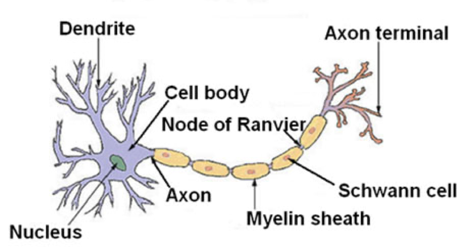

神经元把收到的信息进行计算，并向其他神经元传递信息。

在计算机中实现的神经网络使用了一个很简单的模型来模拟神经元工作。

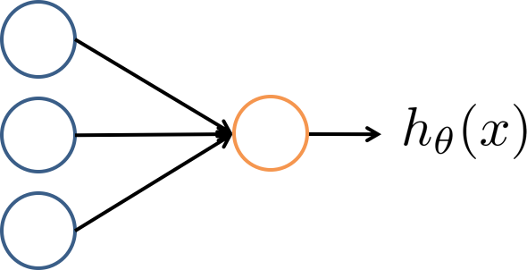

**Sighmoid (logistics) activation function**

我们将上面这个模型称为带有sigmoid或者logistic激活函数的人工神经元。

神经网络其实就是一组神经元连接在一起的集合

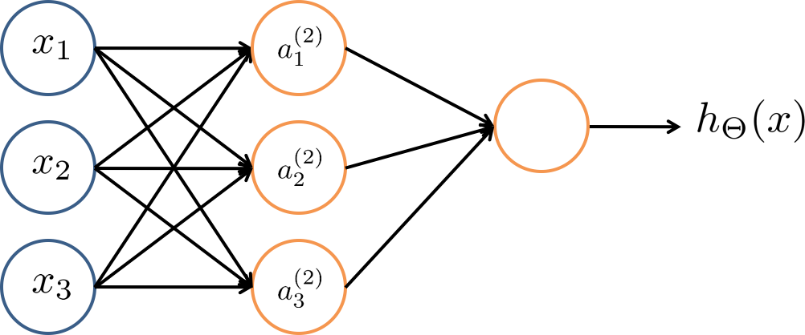

第一层为输入层，最后一层为输出层，中间为隐藏层，神经网络可以有不止一个隐藏层。

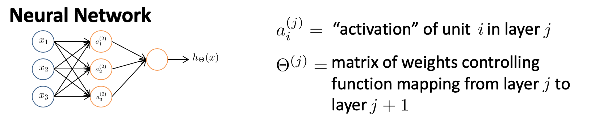

隐藏层中的元素我们用 $a_i^{(j)}$ 来表示，上标 $j$ 表示第几层，下标 $i$ 表示第几个。

$\theta_j$ 就是权重矩阵，控制从某第 $j$ 层映射到第$ j+1$ 层时的权重

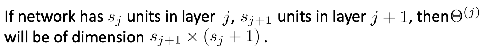

## 模型展示 2

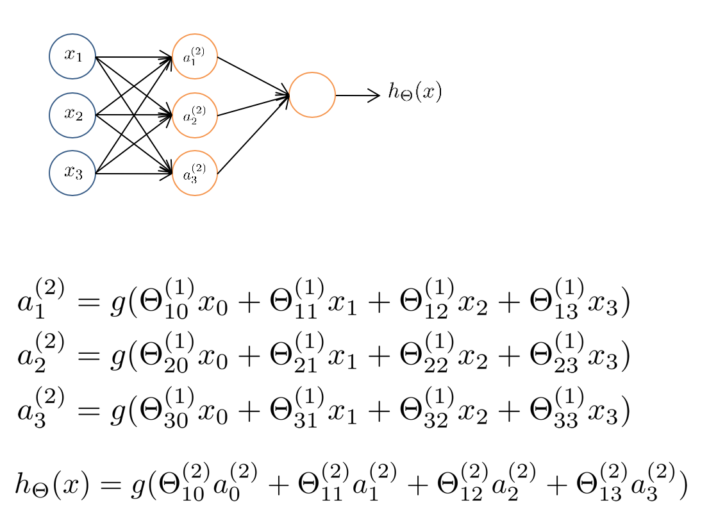

将上面的神经网络向量化后得到：

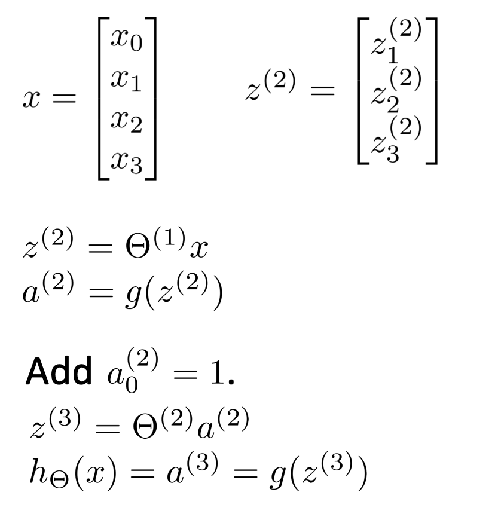

神经网络跟之前所学的逻辑回归根本区别在于，它是将上一层的输出当做下一层的输入，这个从输入层到隐藏层再到输出层一次计算激励的过程叫做forward propagation（前向传播）

## 例子与直觉 1

**XOR 异或门** 

$x_1$ XOR $X_2$ 表示当这两个值恰好一个等于1时，这个式子为真。 

**XNOR 同或门**

两个值同为真或同为假时，这个式子为真。

**AND 逻辑与**

我们先来尝试使用神经网络拟合一个逻辑与运算：

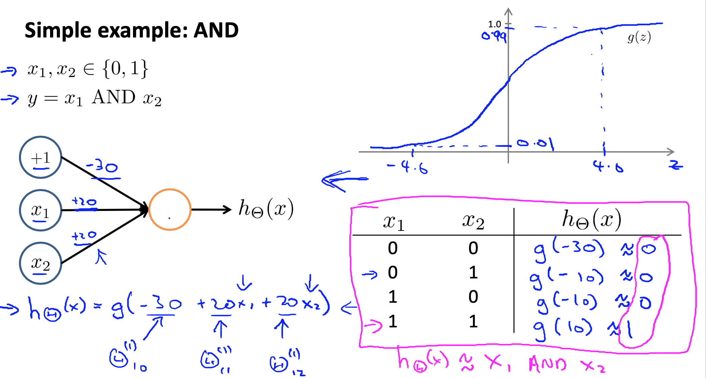

或运算（OR）：

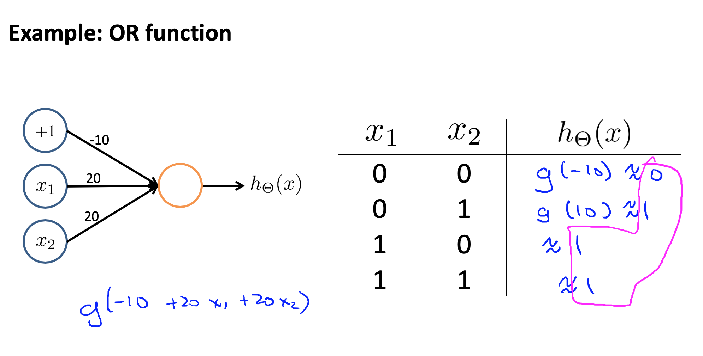

 

## 例子与直觉 2

 **逻辑非（NOT）：**

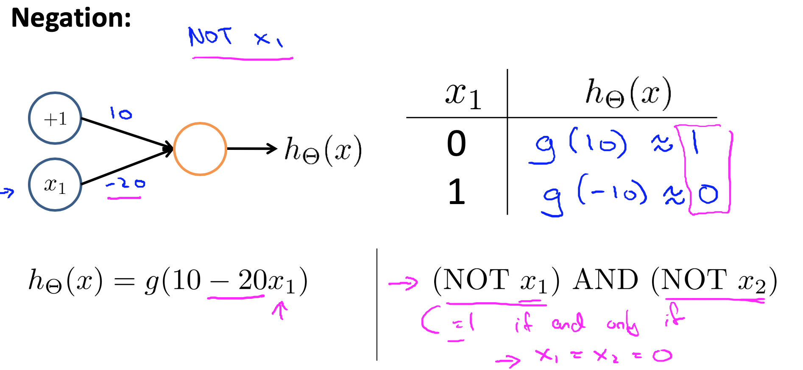

将三部分组合，我们可以得到 **XNOR** 运算：

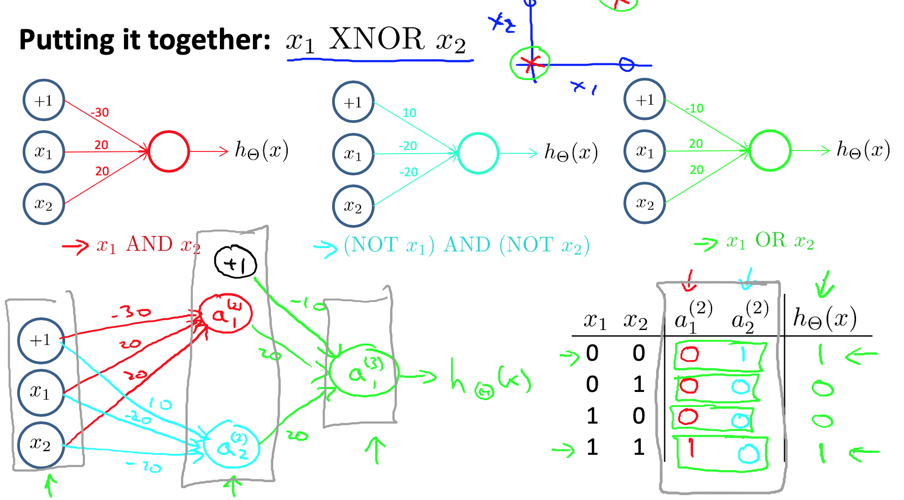

## 多元分类

为了解决多分类问题，我们要做的就是建立一个有多哥输出单元的神经网络。

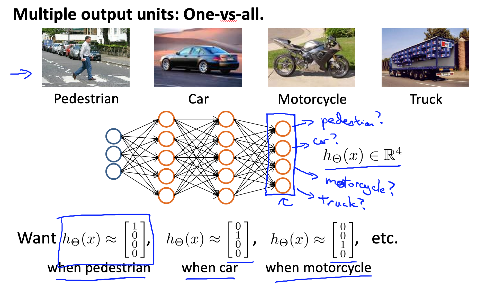

如上图的例子，第一个输出单元用来判断图中是不是行人，第二个判断汽车，第三个判断摩托车，第四个判断卡车，对应输出不同的结果。

