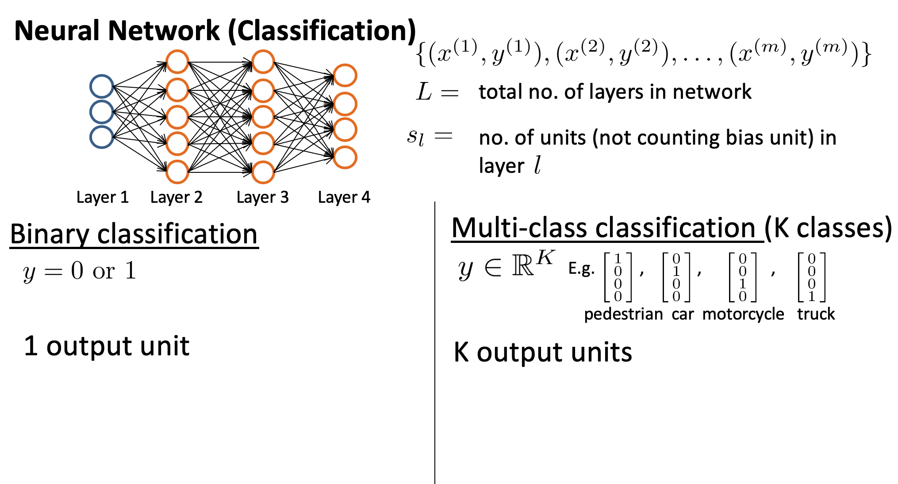
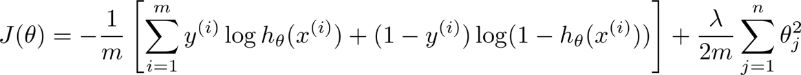
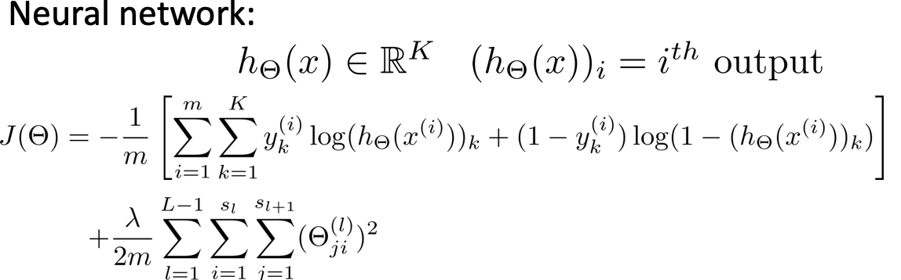
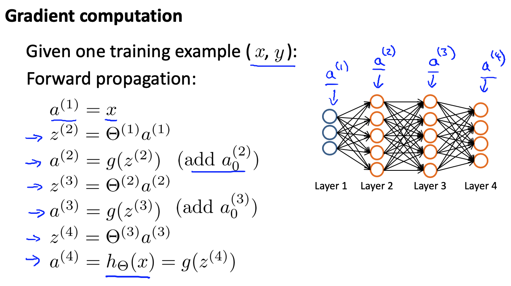
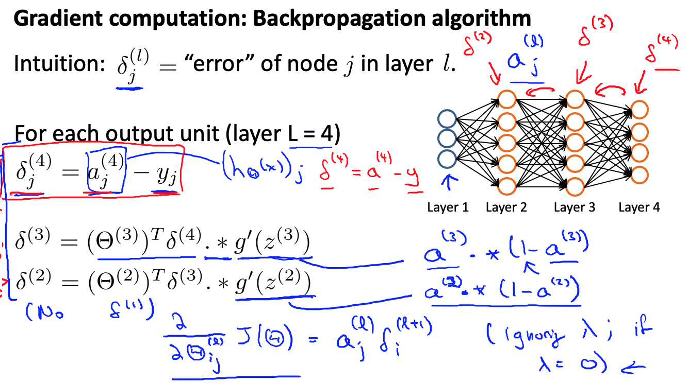
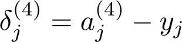
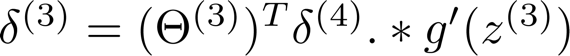
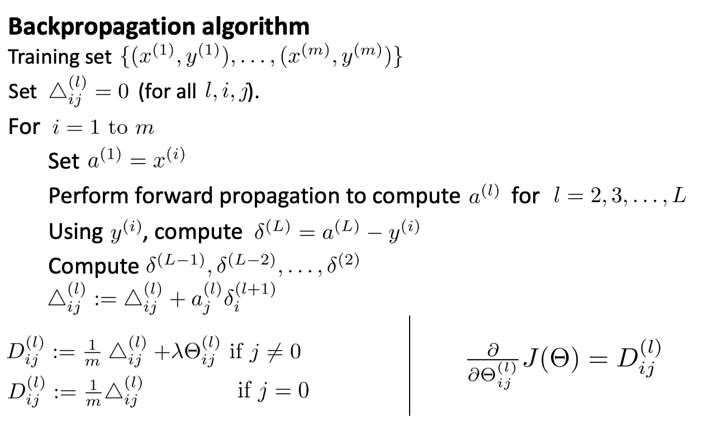

> 这是学习吴恩达《机器学习》的相关笔记
> 
> 相关内容：[深度学习计划][1]

# 神经网络参数的反向传播算法

## 代价函数

我们可以将神经网络的分类问题分为两种情况：

二类分类：$S_L=0, y=0 or 1$表示哪一类

$K$类分类：$S_L=k, y_i = 1$表示分到第$i$类

 在逻辑回归中的代价函数如下：

对于神经网络，$y^{(i)}$ 不再只有一个输出单元，取而代之的是 K 个输出单元，因此，代价函数如下：

$$\begin{gather*} J(\Theta) = - \frac{1}{m} \sum_{i=1}^m \sum_{k=1}^K \left[y^{(i)}_k \log ((h_\Theta (x^{(i)}))_k) + (1 - y^{(i)}_k)\log (1 - (h_\Theta(x^{(i)}))_k)\right] + \frac{\lambda}{2m}\sum_{l=1}^{L-1} \sum_{i=1}^{s_l} \sum_{j=1}^{s_{l+1}} ( \Theta_{j,i}^{(l)})^2\end{gather*}$$

## 反向传播算法（BP算法，Backpropagation）

前向传播：

为了计算代价函数的偏导数$\frac{\partial}{\partial\Theta^{(l)}_{ij}}J\left(\Theta\right)$，我们需要采用一种反向传播算法，也就是首先计算最后一层的误差，然后再一层一层反向求出各层的误差，直到倒数第二层。

$\delta_j^{(i)}$ 是第 $l$ 层的第 $j$ 个节点的误差，也就是预测值减去真实值。

上面是一个四层的神经网络，当我们计算第四层的误差时：

计算其他几层误差：

不需要计算第一层，因为第一层为输入层，没有误差。

**反向传播算法：**

## 展开参数

## 梯度检测

## 随机初始化

## 组合在一起

## 无人驾驶

