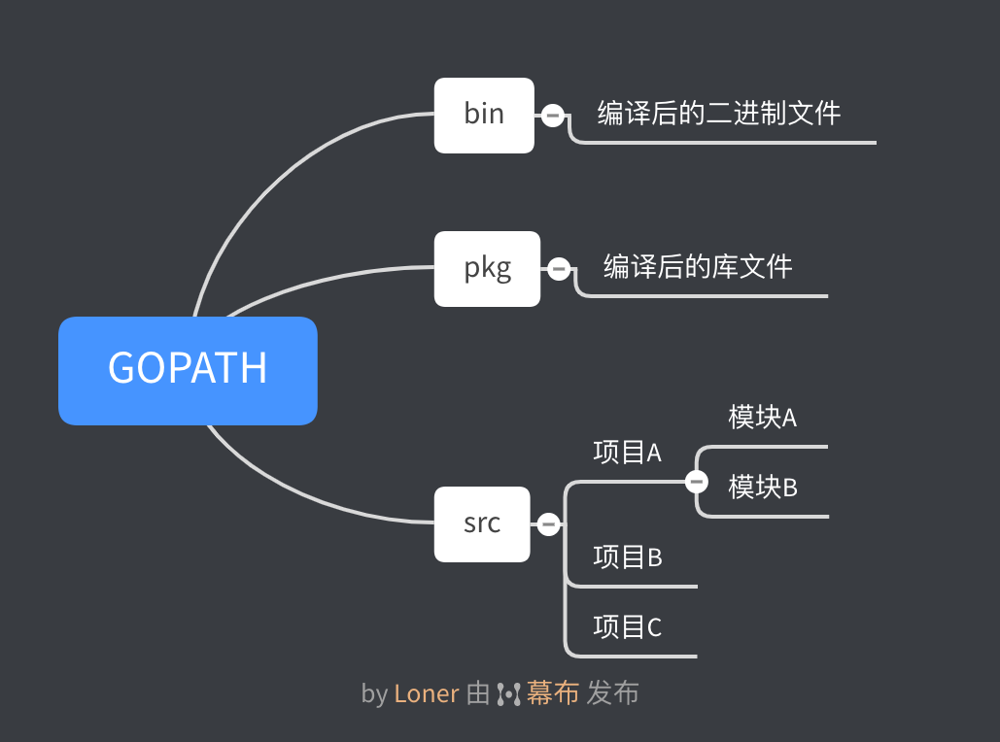
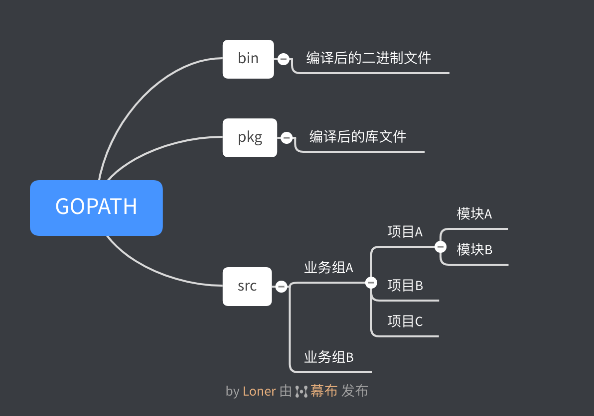
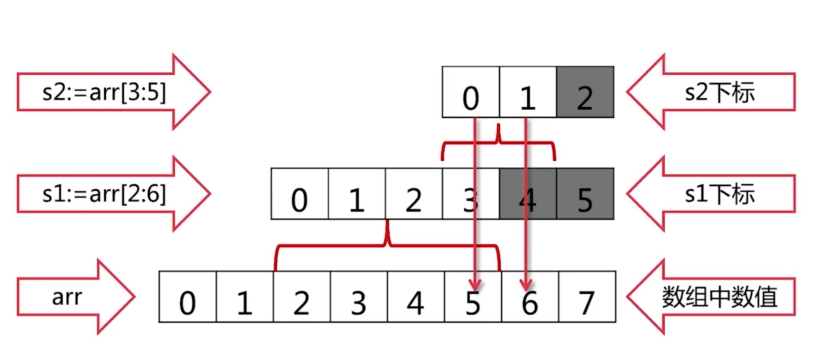

# 发展历史

诞生于2006年1月2日下午15点4分5秒

2009正式发布并开源

2012年 Go 1.0

TIOBE 排名第10（2020.3）

# 环境搭建

官网下载安装包：https://golang.org/ 

国内镜像：https://golang.google.cn

添加环境变量：

```shell
cd ~
sudo vi .zshrc
```

添加下面的内容：

```shell
export PATH=$PATH:/usr/local/go/bin
export GOPATH=/Project/go
export GOBIN=$GOPATH/bin
```

重新载入配置：

```shell
source ~/.zshrc 
```

配置代理，否则国内无法正常安装包

```shell
go env -w GO111MODULE=on
go env -w GOPROXY=https://goproxy.io,direct
```

这个代理由google提供，国内也有一些厂商提供了镜像。

# 目录结构划分

## 个人



## 企业



# Hello，World

在`src`目录下新建`hello`文件夹，新建`hello.go`文件

```go
package main

import "fmt"

func main() {
	fmt.Println("Hello, World!")
}
```

还需要在项目文件夹下新建一个`go.mod`文件用于管理包，否则无法编译，这是go在1.1.1后加入的新特性。

编译文件：

```shell
go build
```

编译后会在项目文件夹生成`hello`文件

运行：

```shell
./hello
```

# 基本语法

## 变量

### 变量定义

```go
var a,b,c bool
var s1,s2 string = "hello","world"
```

变量定义可以放在包内，也可以放在函数内

使用`var()`可以集中定义变量

```go
var(
  aa = 3
  ss = "kkk"
  bb = true
)
```

变量类型并非必要手动声明，编译器可以自动决定：

```go
var a,b,c = 'test',true,123
```

使用`:=`定义变量，可以不使用`var`，但只能在函数内使用

```go
a,b,s1 := true,"hello",456
```

### 内建变量类型

```go
bool
string
(u)int,(u)int8,(u)int16,(u)int32,(u)int64 // 不同C长度整数，u为无符号整数
uintptr // 指针
byte
rune // 字符型 类似char，针对多语言优化
float32,float64 // 浮点型
complex64,complex128 // 复数类型
```

### 强制类型转换

```go
var a,b int =3,4
var c int = math.Sqrt(a*a+b*b) // 出错
var c int = int(math.Sqrt(float64(a*a+b*b)))
```

## 常量

Go 语言的变量一旦定义，必须使用，否则编译报错。

### 常量定义

与变量相似

```go
const filename = "abd.txt"
const a,b int =3,4
```

### 枚举类型

```go
const(
  cpp = 0
  java = 1
  python = 2
  golang = 3
)
const(
  // 自增值，和上面的定义等价，0，1，2，3
  cpp = iota
  java
  python
  golang
)
const(
  // 自增值
  cpp = iota  // 自增方法可以使用表达式，例如：1 << (10 * iota)
  _          // 跳过某个位置
  python
  golang
)
```

## 条件语句

### if

```go
if v > 100 {
  return 100
} else if v < 0 {
  return 0
} else {
  return v
}
```

`if`条件里可以赋值，`if`的条件里赋值的变量作用域就在这个`if`语句里

### switch

```go
var result int
switch op {
  case "+"：
  	result = a+b
  case "-":
  	result = a-b
  case "*":
  	result = a*b
  case "/":
  	result = a/b
  default:
  	panic("unsupposed operator" + op)  // 报错
  return result
}
```

`switch`会自动`break`，除非使用`fallthrough`

`switch`后不一定需要表达式：

```go
g := ""
switch {
  case score < 0 || score > 100:
    default:
  		panic(fmt.Sprintf("Wrong score: %d",score))
  case score < 60: 
  	g = "F"
  case score < 80:
  	g = "C"
 	case score < 90
  	g = "B"
  case score <= 100
  	g = "A"
  default:
  	panic(fmt.Sprintf("Wrong score: %d",score))
}
```

## 循环语句

### for

Go 语言中只有`for`一种循环。

`for`条件里不需要括号，可以省略初始条件，结束条件，递增表达式，通过省略条件，可以当`while`使用。

```go
sum := 0
for i:=1;i<=100;i++ {
  sum += i
}
```

 ## 函数

```go
func Test(a,b int) int { //第一行，参数，返回值类型
  /* Your code */
  return a
}
```

Go 语言函数可以返回多个值

```go
func div(a,b int) (int int) {  // 返回值类型也可以写成 (q,r int) 的形式，直接 return 会默认返回函数内的 q，r 的值
  return a/b, a%b
}
q, r := div(13,3) // 接受返回值
```

### 函数式编程

函数式编程，函数的参数也可以是一个函数

```go
// 这段代码接收3个参数，其中第一个参数 op 为函数，也可以直接写成一个匿名函数
func apply(op func(int int) int, a, b int) int {
	return op(a,b)
}
```

### 可变参数列表

```go
func sum(numbers ...int) int {
	s := 0
	for i := range numbers {
		s += numbers[i]
	}
}
sum(1,2,3,4,5) // 调用函数，可以传入不限制数量的参数，到函数内部类似与数组
```

##   指针

Go 语言的指针相对于 C 语言更加简单

```go
var a int = 2
var pa *int = &a
*pa = 3
fmt.Println(a)  // 输出 3
```

Go 语言指针不能运算

### 参数传递

Go 语言只有值传递，没有引用传递，通过指针的使用可以实现引用传递。

```go
func swap(a,b *int) {
  *b,*a = *a,*b
}
```

# 内建容器

## 数组

### 数组定义

```go
var arr1 [5]int // 定义一个数组，元素初始值为 0
arr2 := [3]int{1,3,5} // 可以直接 := ，但需要给出初始值
arr3 := [...]int{2,4,5,6}  // 自动决定长度
var grid [4][5]int // 二维数组
```

### 遍历数组

```go
for i:=0;i<len(arr3);i++{
  fmt.Println(arr3[i])
}
```

更常用的是`range`，使用`range`意义明确、美观

```go
for i := range arr3 {  // range 可以获得数组元素的下标
  fmt.Println(arr3[i])
}

for i,v := range arr3 {  // range 也可以直接获得元素值
  fmt.Println(i,v)
}
```

我们可以通过`_`来省略变量，只获得元素值

```go
for _,v := range arr3 {  // 只获得值
  fmt.Println(v)
}
```

### 数组是值类型

`[10]int`和`[20]int`是不同类型

函数传入数组时，仍然是值传递，不会改变原数组，但通过指针可以实现引用传递数组

## 切片(slice)

```go
arr := [...]int {0,1,2,3,4,5,6,7}
arr[2:6]  // 2，3，4，5
```

使用`Slice`可以实现直接对数组的操作，`Slice`本身没有数据，是对底层 array 的一个 view

```go
arr := [...]int {0,1,2,3,4,5,6,7}
s := arr[2:6]
s[0] = 10 // arr 变为 [0,1,10,3,4,5,6,7]
```

### Reslice

```go
s := arr[2:6]
s = s[:3]
s = s[1:]
s = arr[:]
```

### Slice 的扩展

```go
arr := [...]int {0,1,2,3,4,5,6,7}
s1 := arr[2:6]  // [2,3,4,5]
s2 := s1[3:5]  // [5,6]
```



`Slice`可以向后扩展，不可以向前扩展，向后不能超过底层数组的长度 `cap(s)`

### 向 Slice 添加元素

 ```go
s2 := append(s1,10) // 向s1添加元素10，会修改底层数组，除非添加元素超越cap
 ```

添加元素时如果超越cap，系统会重新分配更大的底层数组

由于值传递的关系，必须接收`append`的返回值

```go
s = append(s,val)
```

### 创建 Slice

前面使用了`array`创建`Slice`，也可以直接创建`Slice`

```go
var s []int
s1 := []int{2,4,6,8}
s2 := make([]int,16) // 指定长度的 Slice
s3 := make([]int,10，32) // 指定 Slice 的长度和底层数组（cap）的长度
```

### Copying Slice

```go
copy(s2,s1) // s1 拷贝到 s2
```

### 删除元素

```go
s2 = append(s2[:3],s2[4:]...) // 删除下标为 3 的元素
```

## Map

### 创建map

```go
m := map[string]string {   // map[key type]value type
  "name":"Loner"
  "gendle":"male"
}
```

使用`map[k]v`来定义`map`，也可以定义复合`map`：`map[k1]map[k2]v`

也可以通过`make`来建立`map`

```go
m2 := make(map[string]int) // 定义空map，m2 == empty map
var m3 map[string]int // m3 == nil
```

### map 遍历

与数组遍历类似，map 内的元素是无序的，如需顺序，需要手动排序

```go
for k,v := range m {
  fmt.Println(k,v)
}
```

### 访问元素

```go
name := m["name"]
```

当访问的 key 不存在时，会返回 ZeroValue

通过接收返回值可以判断 key 是否存在

```go
name,ok := m["nama"]  // 元素存在，则 ok 接收到 true，反之为 false
```

### 删除元素

```go
delete(m,"name")
```

### map 的 key

map 使用哈希表，必须可以比较相等，除了 slice、map、function 的内建类型都可以作为 key，Struct 类型不包含上述字段，也可以作为 key

### 例题：寻找最长不含有重复字符的子串

给定一个字符串，请你找出其中不含有重复字符的 最长子串 的长度。

>示例 1:
>
>输入: "abcabcbb"
>输出: 3 
>解释: 因为无重复字符的最长子串是 "abc"，所以其长度为 3。
>示例 2:
>
>输入: "bbbbb"
>输出: 1
>解释: 因为无重复字符的最长子串是 "b"，所以其长度为 1。
>示例 3:
>
>输入: "pwwkew"
>输出: 3
>解释: 因为无重复字符的最长子串是 "wke"，所以其长度为 3。
>     请注意，你的答案必须是 子串 的长度，"pwke" 是一个子序列，不是子串。
>
>来源：力扣（LeetCode）
>链接：https://leetcode-cn.com/problems/longest-substring-without-repeating-characters

```go
func lengthOfLongestSubstring(s string) int {
	last := make(map[rune]int)
	start := 0
	maxLength := 0
	for i, ch := range s {
		if i, ok := last[ch]; ok && last[ch] >= start {
			start = i + 1
		}
		if i-start+1 > maxLength {
			maxLength = i - start + 1
		}
		last[ch] = i
	}
	return maxLength
}
```

## 字符串处理

### 字符串遍历

用 `decode` 的方式来遍历，对非英文语言有奇效

```go
for i,ch := range []rune(s) {  // 使用 []byte 可以获得所有字节
  fmt.Printf("(%d %c)",i,ch)  // 以实际的字符输出，而非编码形式
}
utf8.RuneCountInString(s)  // 可以获得字符数量
len(s) // 获得字节长度
```

### 使“寻找最长不含有重复字符的子串”支持中文

```go
func lengthOfLongestSubstring(s string) int {
	last := make(map[rune]int)
	start := 0
	maxLength := 0
  for i, ch := range []rune(s) {
		if i, ok := last[ch]; ok && last[ch] >= start {
			start = i + 1
		}
		if i-start+1 > maxLength {
			maxLength = i - start + 1
		}
		last[ch] = i
	}
	return maxLength
}
```

### 其他字符串操作

在 `strings`库中有大量字符串操作

# 面向对象

## 结构体

Go 语言仅支持封装，不支持继承和多态

### 结构的定义

```go
type TreeNode struct {
  Left, Right *TreeNode
  Value int
}
```

Go 语言的结构体，不论地址还是结构本身，一律使用`.`来访问成员

```go
root := TreeNode{value: 3}
root.Left = &TreeNode{}
root.Right = &TreeNode{nil,nil,5}
root.Right.Left = new(TreeNode)
```

### 结构的创建

使用自定义工厂函数：

```go
func createTreeNode(value int) *TreeNode{
  return &TreeNode{Value: value}
}
root.Left.Right = createTreeNode(2)
```

注意返回了局部变量地址，但外部仍可以使用。编译器会自动选择堆或栈来存放局部变量。

### 为结构定义方法

```go
func (node TreeNode) print() {
  fmt.Print(node.value)
}
root.print()  // 调用方法
```

方法仍然是值传递，只有使用才能改变结构的内容。

`nil`指针也可以调用方法

```go
func (node TreeNode) print() {
  if node == nil {
    fmt.Println("Setting value tp nil")
  }
  fmt.Print(node.value)
}
```

### 值接收者和指针接收者

* 要改变内容必须使用指针接收者

* 结构过大也考虑使用指针接收者

* 一致性：如有指针接受者，最好都是指针接收者

## 封装

* 名字一般使用 CamelCase
* 首字母大写：public
* 首字母小写：private

### 包

* 每个目录一个包
* main 包包含可执行入口
* 为结构定义的方法必须放在同一个包内
* 可以是不同文件

 ### 扩展已有类型

 扩充系统类型或者别人的类型

* 定义别名
* 使用组合

 ### GOPATH 环境变量

官方推荐：所有项目和第三方库都放在一个 GOPATH 下

也可以将每个项目放在不同的 GOPATH

# 面向接口

## 接口

### duck typing

大黄鸭是鸭子吗？

从生物学上看并不是鸭子，但它像鸭子，我们就可以叫他鸭子。

`duck typing`：描述事物的外部行为而非内部结构

严格说 go 属于结构化类型系统，类似 duck typing

go 语言的 duck typing 同时具有 python、c++ 的 duck typing 的灵活性，又具有 java 的类型检查。

### 接口的定义和实现

接口由使用者定义，不同于面向对象

```go
type Retriever interface {
  Get(source string) string
}
func download(retriever Retriever) string {
  return retriever.Get("www.imooc.com")
}
```

接口的实现是隐式的，只要实现接口里的方法。

### 接口变量

* 接口变量自带指针
* 接口变量采用值传递，几乎不需要使用接口指针
* 指针接收者实现只能以指针方式使用; 值接收者都可
* 表示任何类型：interface{}

### 接口的组合


 


